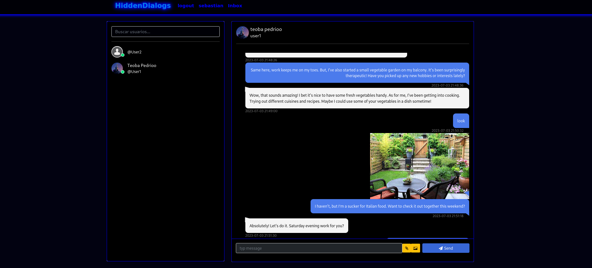
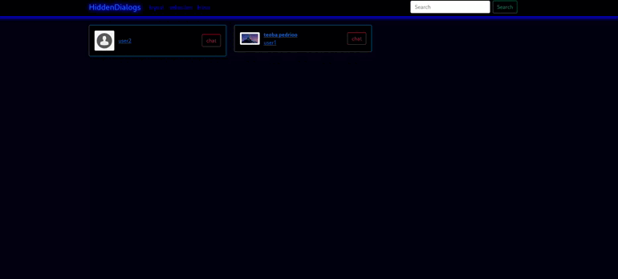

# django_chatting_app
This is a chatting app made with django, bootstrap5, html, css, js and AJAX

# Hidden Dialogs 🗨️

  

  

  

Hidden Dialogs is an interactive chatting web application that allows users to communicate and share files with ease.

## Table of Contents 📘
- [Features](#features-🚀)
- [Technologies](#technologies-💻)
- [Installation](#installation-🛠️)
- [For Linux](#for-linux-🐧)
- [For Windows](#for-windows-🪟)
- [Usage](#usage-🖥️)
- [Contributing](#contributing-🤝)
- [License](#license-📜)

## Features 🚀
- **User Directory**: View all the registered users on the homepage along with their profile image, first name, last name, and username.
- **Profile Viewing**: Click on a user's profile to see more information, including their bio.
- **Instant Messaging**: Click on the chat button to start messaging. The chat feature is equipped with real-time messaging capabilities.
- **File Sharing**: Share documents, images, and other files directly through the chat.
- **Responsive Design**: The application is designed to be user-friendly and responsive on different devices.

## Technologies 💻
Hidden Dialogs is built with the following technologies:
- [Django](https://www.djangoproject.com/)
- [Bootstrap 5](https://getbootstrap.com/docs/5.0/getting-started/introduction/)
- [Python3](https://www.python.org/downloads/)
- HTML5
- CSS3
- JavaScript
- [AJAX](https://developer.mozilla.org/en-US/docs/Web/Guide/AJAX)

## Installation 🛠️

plaintext
# For Linux: 🐧

1. Clone this repository
   `git clone https://github.com/SebastianMou/django_chatting_app`

2. Change to the repository directory
   `cd django_chatting_app`

3. Create a virtual environment
   `python3 -m venv myenv`

4. Activate the virtual environment
   `source myenv/bin/activate`

5. Install the required dependencies
   `pip install -r requirements.txt`

6. Run the Django migrations
   `python3 manage.py makemigrations && python3 manage.py migrate`

7. Start the Django server
   `python3 manage.py runserver`

# For Windows: 🪟

1. Clone this repository
   `git clone https://github.com/SebastianMou/django_chatting_app`

2. Change to the repository directory
   `dir django_chatting_app`

3. Create a virtual environment
   `python -m venv myenv`

4. Activate the virtual environment
   `myenv\Scripts\activate`

5. Install the required dependencies
   `pip install -r requirements.txt`

6. Run the Django migrations
   `python manage.py makemigrations && python manage.py migrate`

7. Start the Django server
   `python manage.py runserver`

## Usage 🖥️
1. Visit `http://127.0.0.1:8000` in your browser.
2. Register for an account or login if you already have one.
3. Browse through user profiles, or click the chat button to start a conversation.
4. Upload files and images by clicking on the attachment icon in the chatbox.

## Contributing 🤝
1. Contributions, issues, and feature requests are welcome...
2. Fork this repository
3. Clone your forked repository

## License 📜
[MIT](https://choosealicense.com/licenses/mit/) License

Copyright (c) [2022] [Sebastián Mauricio Groger Gutiérrez]

Permission is hereby granted, free of charge, to any person obtaining a copy
of this software and associated documentation files (the "Software"), to deal
in the Software without restriction, including without limitation the rights
to use, copy, modify, merge, publish, distribute, sublicense, and/or sell
copies of the Software, and to permit persons to whom the Software is
furnished to do so, subject to the following conditions:

The above copyright notice and this permission notice shall be included in all
copies or substantial portions of the Software.

THE SOFTWARE IS PROVIDED "AS IS", WITHOUT WARRANTY OF ANY KIND, EXPRESS OR
IMPLIED, INCLUDING BUT NOT LIMITED TO THE WARRANTIES OF MERCHANTABILITY,
FITNESS FOR A PARTICULAR PURPOSE AND NONINFRINGEMENT. IN NO EVENT SHALL THE
AUTHORS OR COPYRIGHT HOLDERS BE LIABLE FOR ANY CLAIM, DAMAGES OR OTHER
LIABILITY, WHETHER IN AN ACTION OF CONTRACT, TORT OR OTHERWISE, ARISING FROM,
OUT OF OR IN CONNECTION WITH THE SOFTWARE OR THE USE OR OTHER DEALINGS IN THE
SOFTWARE.
